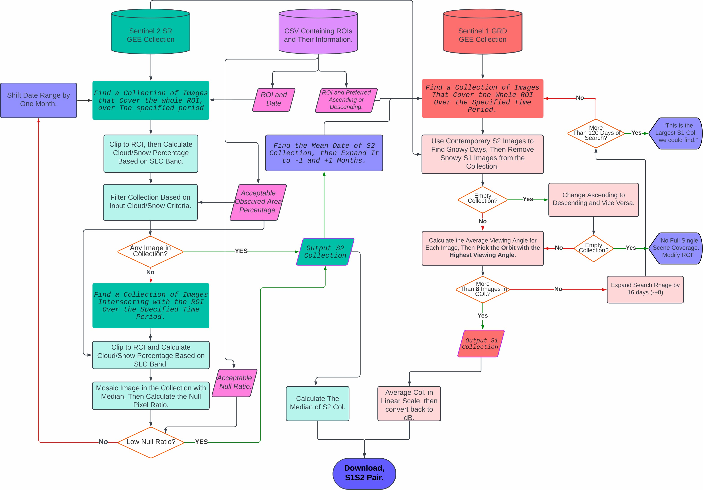
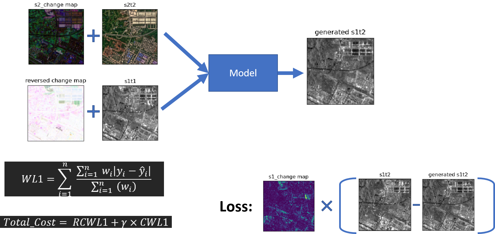

# DCTS‑GAN: An Optic2SAR Dual Conditional GAN for Sentinel‑1 Temporal Shifting using

This is the code implementation of the paper [TSGAN: An Optical-to-SAR Dual Conditional GAN for Optical based SAR Temporal Shifting](https://arxiv.org/abs/2401.00440) by Moien Rangzan, Sara Attarchi, Richard Gloaguen and Seyed Kazem Alavipanah. The paper is submitted to ISPRS Journal of Photogrammetry and Remote Sensing.

# Abstract
In contrast to the well-investigated field of SAR-to-Optical translation, this study explores the lesser-investigated domain of Optical-to-SAR translation, a challenging field due to the ill-posed nature of this translation. The complexity arises as a single optical data can have multiple SAR representations based on the SAR viewing geometry. We propose a novel approach, termed SAR Temporal Shifting, which inputs an optical data from the desired timestamp along with a SAR data from a different temporal point but with a consistent viewing geometry as the expected SAR data, both complemented with a change map of optical data during the intervening period. This model modifies the SAR data based on the changes observed in optical data to generate the SAR data for the desired timestamp. Our model, a dual conditional Generative Adversarial Network (GAN), named Temporal Shifting GAN (TSGAN), incorporates a siamese encoder in both the Generator and the Discriminator. To prevent the model from overfitting on the input SAR data, we employed a change weighted loss function. Our approach surpasses traditional translation methods by eliminating the GAN's fiction phenomenon, particularly in unchanged regions, resulting in higher SSIM and PSNR in these areas. Additionally, modifications to the Pix2Pix architecture and the inclusion of attention mechanisms have enhanced the model's performance on all regions of the data. This research paves the way for leveraging legacy optical datasets, the most abundant and longstanding source of Earth datary data, extending their use to SAR domains and temporal analyses.


# Proposed Model
The architecutre of the proposed model is shown below. For detailed information please refer to the paper.

| Generator | Discriminator | 
| :---: | :---: |
|  |  |


# How to use

## 1. Download the dataset
To download the dataset you can simply run this notebook in on your local machine or on Google Colab. The notebook will download the dataset and preprocess and patch it. The notebook is available in the [notebooks](.\dataset\Dataset_creator.ipynb) folder.


This fellowchart shows the steps of the dataset creation process.



### Add your own data
To add your own data to the dataset you can adjust the `.xlsx` files in the [dataset](.\dataset) folder. 

Each row in the `.xlsx` files represents an ROI. With the following columns:

- **name**: The name of the ROI. This name will be used to create the folder structure.

- **year**: The year of the ROI. This will be used to create the folder structure. (should be two digits e.g. 21)

- **roi**: the roi in format of a list of coordinates. e.g. `[[[10,10],[10,20],[20,20],[20,10]]]`

- **date**: start and end date of S2 search. (should be in format of `YYYY-MM-DD`)

- **priority_path**: First check Ascending or Descending orbits. 

- **check_second_priority_path**: If the first priority path is not available, check the second priority path.

- **max_cloud**: Maximum cloud coverage of S2 images.

- **max_snow**: Maximum snow coverage of S2 images. If you are using high max cloud percentages, sentinel algorithm can falsely detect snow as cloud. 

- **month_span**: The inital expantion of month around the S2 mean date. For S1 search.

- **retry_days**: The number of days to add to the span search if no S1 image was found.

- **train_test**: Whether to use the ROI for training or testing. (should be `train` or `test`)

- **type**: Addional information about the ROI.

Make sure you have two `.xlsx` files. Each represneting a year.

**Update**: I am working on making a python module instead of the need of all above steps. But you're gonna need a google cloud account to use it. I will update this section as soon as I finish it.


## 2. Train the model


## Results


# Model




# Credits
If you find this work useful, please consider citing:

```bibtex
    @misc{rangzan2023tsgan,
      title={TSGAN: An Optical-to-SAR Dual Conditional GAN for Optical based SAR Temporal Shifting}, 
      author={Moien Rangzan and Sara Attarchi and Richard Gloaguen and Seyed Kazem Alavipanah},
      year={2023},
      eprint={2401.00440},
      archivePrefix={arXiv},
      primaryClass={cs.CV},
      url={https://arxiv.org/abs/2401.00440}}

```
