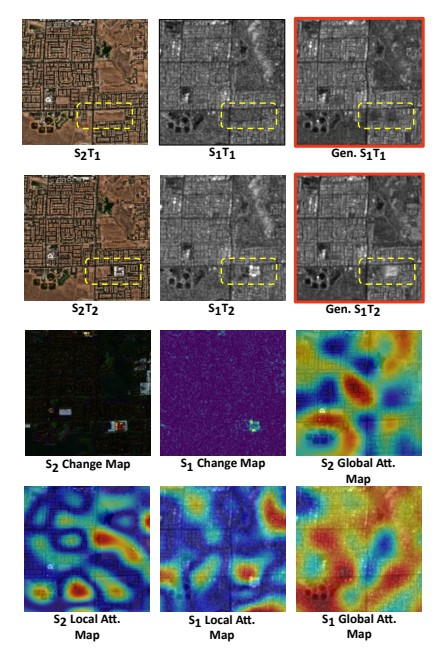

# SAR Temporal Shifting: A New Approach for Optical-to-SAR Translation with Consistent Viewing Geometry

This is the code implementation of the paper [SAR Temporal Shifting: A New Approach for Optical-to-SAR Translation with Consistent Viewing Geometry](https://www.mdpi.com/2072-4292/16/16/2957) by Moien Rangzan, Sara Attarchi, Richard Gloaguen, and Seyed Kazem Alavipanah.

Please feel free to contact me if you have any questions or problems with the code, and I'll be more than happy to help. You can reach me at [moienrangzan@gmail.com](mailto:moienrangzan@gmail.com)   

Thank you for your interest in our work!

# Simplified Abstract
Unlike the more extensively studied SAR-to-Optical translation, Optical-to-SAR translation has been less researched because generating a correct SAR representation from optical images with the appropriate SAR viewing geometry is inherently challenging.  To address this, we developed an algorithm to generate a bitemporal viewing geometry-consistent SAR/Optical dataset and a novel model to learn this translation. Our hypothesis posited that in datasets where landscape changes between two timestamps are imbalanced compared to regions of no change, models tend to overfit the input same-domain data. At the same time, traditional metrics might still indicate good results due to the averaging effect. To discern and address this issue, we introduced novel spatial metrics to first discern and prove this hypothesis and then an algorithm-level approach with a new cost function that balances training and prevents the model from overfitting on the input SAR data. The results demonstrate the superiority of our approach over naive bitemporal methods that do not account for dataset distribution. 

**Key contributions of our study include:**

  •	**Novel Bitemporal Approach:** Introducing the first viewing geometry consistent bitemporal methodology for Optical-to-SAR translation, significantly advancing this under-researched field.

  •	**Dataset Creation:** Developing an open-source algorithm for generating a bitemporal viewing geometry-consistent SAR/Optical dataset.

  •	**New Spatial Metrics:** Proposing new spatial metrics to detect overfitting problems inherent in traditional methods.

  •	**Change-Weighted Loss Function:** Implementing a novel cost function to balance training and prevent overfitting on input data.


# Proposed Model
The architecture of the proposed model is shown below. For detailed information, please refer to the paper.

| Generator | Discriminator | 
| :---: | :---: |
|  |  |


# How to use

## 1. Download the dataset
To download the dataset you can simply run [this notebook](./dataset/Dataset_creator.ipynb) in on your local machine or
<a target="_blank" href="https://colab.research.google.com/github/moienr/TemporalGAN/blob/main/dataset/Dataset_creator.ipynb">
  
</a>
. The notebook will download the dataset and preprocess it.

A detailed description of the dataset and how to add your own data can be found in the [dataset](./dataset/) folder.

## 1.1. Hard Evaluation
In the paper, we mention that in order to evaluate the model, we have used a hard evaluation method. In this method, around 150 images were selected from the test dataset, and these images showed discernable urban changes. These images are listed in [this file](./changedetection/changed_pairs.csv). 

If you went on and built your own dataset, you can use the same method to evaluate your model. Follow [this notebook](./changedetection/tensor_cd.ipynb) to create a new `.csv` file containing the images you want to evaluate your model on.


## 2. Train the model
To train the model, run the [train.py](./train.py) file. 

```bash
> conda activate pytorch_env
> python train.py --num_epoch <number of epochs> --changed_l1_weight <weight of the changed L1 loss> 
```

Example:
```bash 
> python train.py --num_epoch 10 --changed_l1_weight 5 --gen_version 1.3 --no_input_change_map 
```

Help:
```bash
> python train.py --help
```


## 3. Results
This simple animation explains our approach.


<!--  -->

<!--  -->


<!--  -->
 

## There is more!
The models you saw in the paper are only a handful of the models that have been tested. 

In the [temporalgan](./temporalgan/) folder, you can find the code for most of the models that have been tested. I tested multiple attention mechanisms at different levels of the model. CBAM and PAM are the two attention mechanisms that didn't make it to the paper.

Also, GLAM has been used in both 8x8 and 16x16 levels of the model.

Be careful in deleting unwanted models, as **subversion of each model inherits from the previous model**. For example, if you delete the `v1.2` folder, you will corrupt the `v1.3`, `v1.5`, and `v1.6` models.

So feel free to play around with the code and see what you can come up with.

Here is a beautiful sketch of my initial ideas for the model architecture :)


# Credits
If you find this work useful, please consider citing:

```bibtex
@Article{rs16162957,
AUTHOR = {Rangzan, Moien and Attarchi, Sara and Gloaguen, Richard and Alavipanah, Seyed Kazem},
TITLE = {SAR Temporal Shifting: A New Approach for Optical-to-SAR Translation with Consistent Viewing Geometry},
JOURNAL = {Remote Sensing},
VOLUME = {16},
YEAR = {2024},
NUMBER = {16},
ARTICLE-NUMBER = {2957},
URL = {https://www.mdpi.com/2072-4292/16/16/2957},
ISSN = {2072-4292},
DOI = {10.3390/rs16162957}
}

```
